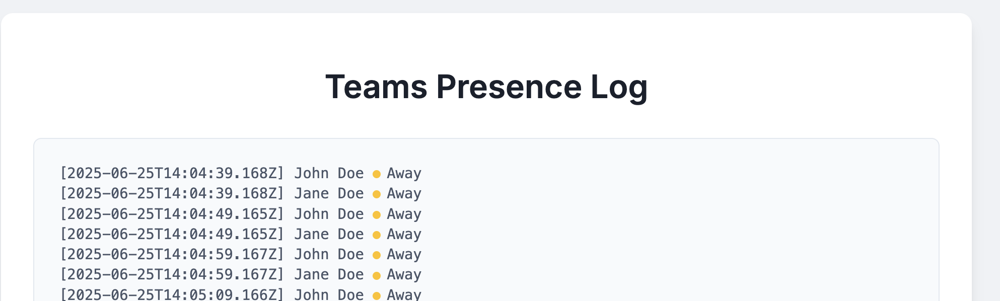

# Browser extension to log MS Teams presence activity for recon and phishing planning.

Extend with your own functionality to do recurring pattern timestamp analysis to figure out when targets are available/in meetings/away etc.

